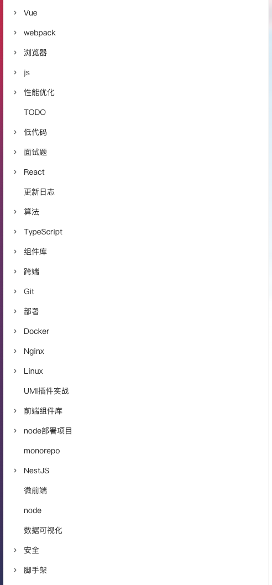
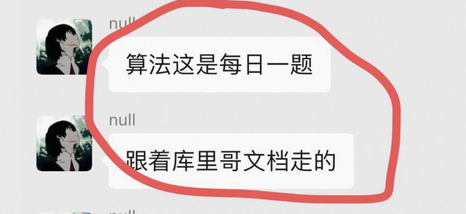
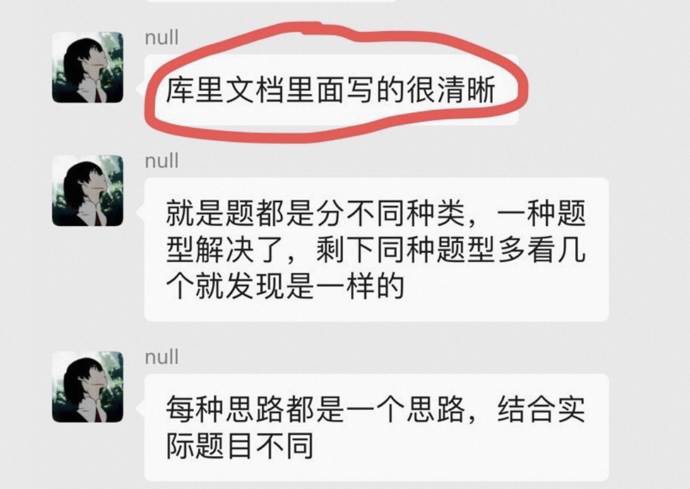
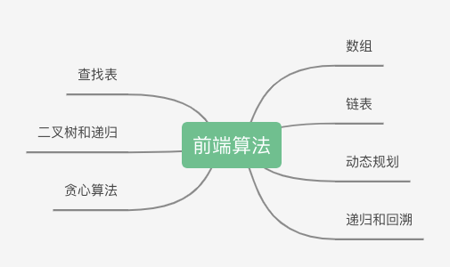
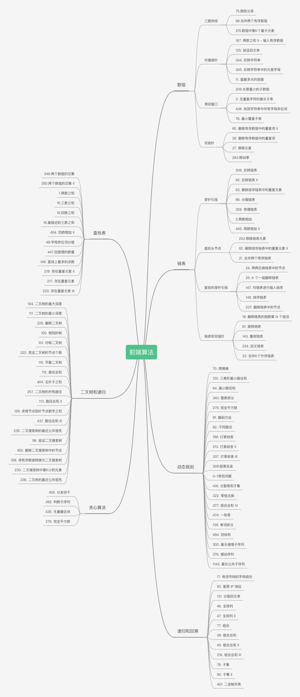

# fe-interview
🔥🔥🔥 前端面试、前端算法、前端项目实战，独有前端面试题详解，前端面试刷题必备，1000+前端面试真题，Html、Css、JavaScript、Vue、React、Node、TypeScript、Webpack、算法、网络与安全、浏览器、低代码、前端脚手架、前端组件库、微前端、Docker、小程序、设计模式、性能优化、Nginx、Linux、NestJs、NextJs

# 学什么
- 面试题：前端各种八股文
- 组件库： 从0到1使用ts+react实战开发组件库。
- 脚手架：从0到1掌握脚手架开发，使用工程化提效，进阶高级前端。
- webpack：掌握webpack使用/原理/常考面试题。
- 安全：通过实战掌握XSS/CSRF/SQL注入/点击劫持等漏洞
- TypeScript：从0到1掌握ts知识，构建ts体系。
- 低代码：掌握低代码开发思路，进入低代码领域。
- 算法：分类学习算法，通过大厂算法考试。
- 微前端：掌握微前端体系知识，学会自己动手实现简单的微前端框架。
- Docker：掌握前后端分离的项目部署。
- 小程序：小程序入门，从0到1开发一个小程序。
- 设计模式：掌握js设计模式，写出高质量代码。
- 性能优化：掌握全链路的性能优化的方法。
- node：学会使用node开发接口。
- Linux：掌握linux核心知识和上线部署
- Nginx: 0基础学习nginx体系知识，反向代理、负载均衡
- NestJS：学会nestjs开发服务端项目
- 代码管理：使用git学会代码管理
- python
- golang
- AI
- chatgpt

# 怎么学
我会很详细的把每个项目的每个点都写到文档里面，不管是实战项目，还是八股文，算法

# 答疑
有什么问题随时联系我，有什么想学的也可以告诉我，只要会的，都会更新上去。

# 联系
在国内Top1/Top2工作。感兴趣一起学习的可以加我微信，不感兴趣的也可以和我交流，多个朋友。

我会在下面几个平台更新反卷计划进度和技术视频。
- 抖音：程序员库里
- B站：程序员库里
- 小红书：程序员库里

微信：

# 粉丝朋友寄语&评价

时间无价、知识无价。冲！！！

# 内推
有很多大厂ld的人脉资源，加入前端反卷计划可以推荐简历直达ld手里。

# 算法

## 整体思维导图

## 分类思维导图

## 数组

### 三路快排

- [75.颜色分类](/code/Algorithm/Array/sort-colors.md)

- [88.合并两个有序数组](/code/Algorithm/Array/merge-sorted-array.md)

## 查找表

## 链表

## 递归和回溯

## 二叉树

## 动态规划

## 贪心算法